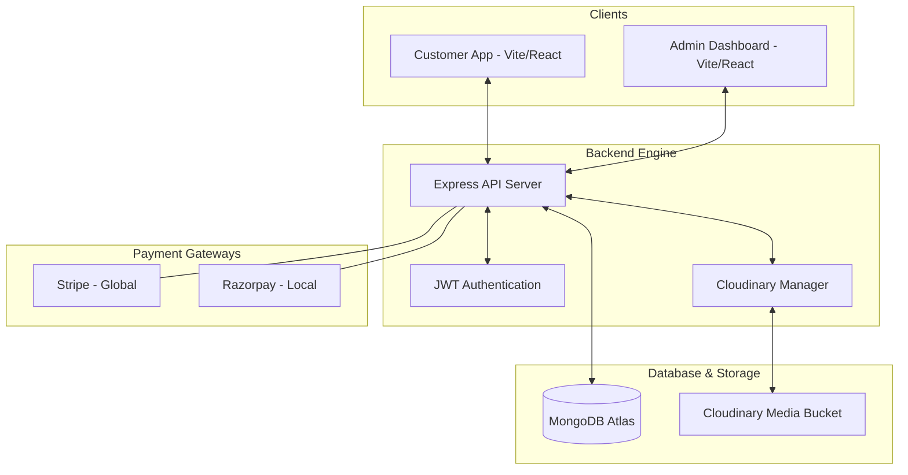
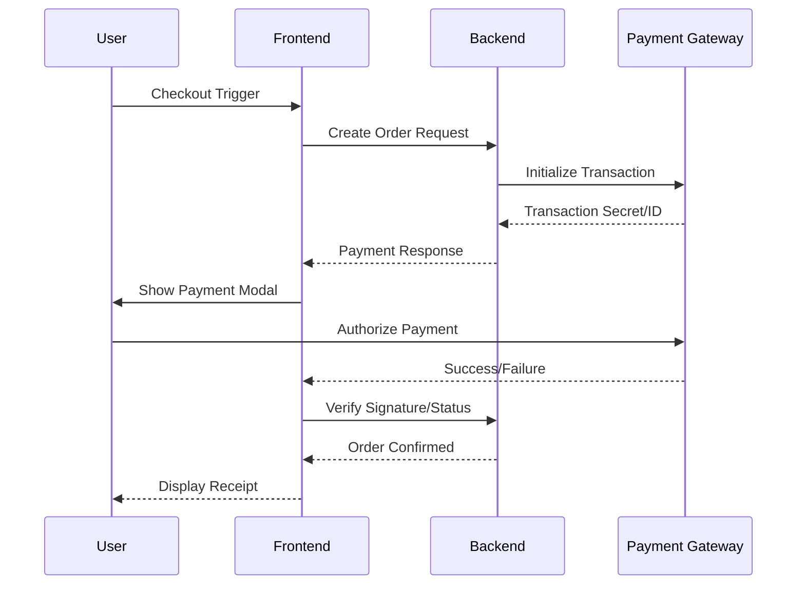

<div align="center">

# 👑 SONI MONI ROYAL COLLECTION
### Premium Multi-Vendor E-Commerce Ecosystem

[](https://mongodb.com)
[](https://vitejs.dev)
[](https://tailwindcss.com)
[](https://cloudinary.com)
[](https://stripe.com)

---

**Soni Moni Royal Collection** is a sophisticated, full-stack E-commerce solution designed for seamless luxury shopping. Built on the MERN stack, it features dual-integrated payment gateways, a bespoke admin dashboard, and cloud-based media management.

[Live Store](https://monisoniroyalcollection.in) • [Admin Panel](https://son-moni-admin.vercel.app) • [API Docs](#api-overview)

</div>

---

## 🏗️ System Architecture

The following diagram illustrates the decoupled architecture and data flow between the Customer Frontend, Admin Dashboard, and the Node.js API.



---

## 🔥 Key Features

### 🛍️ Customer Experience
- **Dynamic Product Filtering**: Advanced sorting by category, sub-category, and price.
- **Smart Shopping Cart**: Persistent cart state with real-time stock validation.
- **Dual Payment Precision**: Seamlessly switch between **Razorpay** (INR) and **Stripe** (International).
- **Order Tracking**: Comprehensive dashboard for monitoring order lifecycle and history.
- **Responsive Mastery**: Fluid UI optimized for Mobile, Tablet, and Desktop.

### 🛡️ Admin Powerhouse
- **Inventory Control**: Add, update, and manage luxury products with ease.
- **Order Management**: Real-time status updates (Order Placed -> Shipped -> Delivered).
- **Analytics Dashboard**: Overview of total sales, best-selling products, and user metrics.
- **Secure Access**: Protected admin routes with specialized JWT verification.

---

## 🛠️ Technological Foundation

| Layer | Technologies |
| :--- | :--- |
| **Frontend** | React 18, Vite, Tailwind CSS, Axios, React Router, React Toastify |
| **Backend** | Node.js, Express.js, JWT, Bcrypt, Multer |
| **Database** | MongoDB (via Mongoose ODM) |
| **Integrations** | Cloudinary (Image Hosting), Stripe (Global), Razorpay (India) |
| **Infrastructure** | Vercel (Deployment), Dotenv (Config Management) |

---

## ⚙️ Local Setup Guide

Follow these steps to replicate the environment on your machine.

### 1. Repository Initialization
```bash
git clone https://github.com/mohitmudgil/soni-moni.git
cd soni-moni
```

### 2. Environment Configuration
Create a `.env` file in the `backend/` directory:
```env
MONGODB_URI=your_mongodb_uri
JWT_SECRET=your_secret_key
CLOUDINARY_API_KEY=your_key
CLOUDINARY_SECRET_KEY=your_secret
CLOUDINARY_NAME=your_name
STRIPE_SECRET_KEY=your_stripe_key
RAZORPAY_KEY_ID=your_razorpay_id
RAZORPAY_KEY_SECRET=your_razorpay_secret
```

### 3. Execution
```bash
# Start Backend
cd backend
npm install
npm run server

# Start Frontend
cd ../frontend
npm install
npm run dev

# Start Admin
cd ../admin
npm install
npm run dev
```

---

## 💳 Payment Lifecycle Workflow



---

<div align="center">

Built with ❤️ by **Mohit Mudgil** & Team
[Visit Website](https://monisoniroyalcollection.in)

</div>
// redeploy
